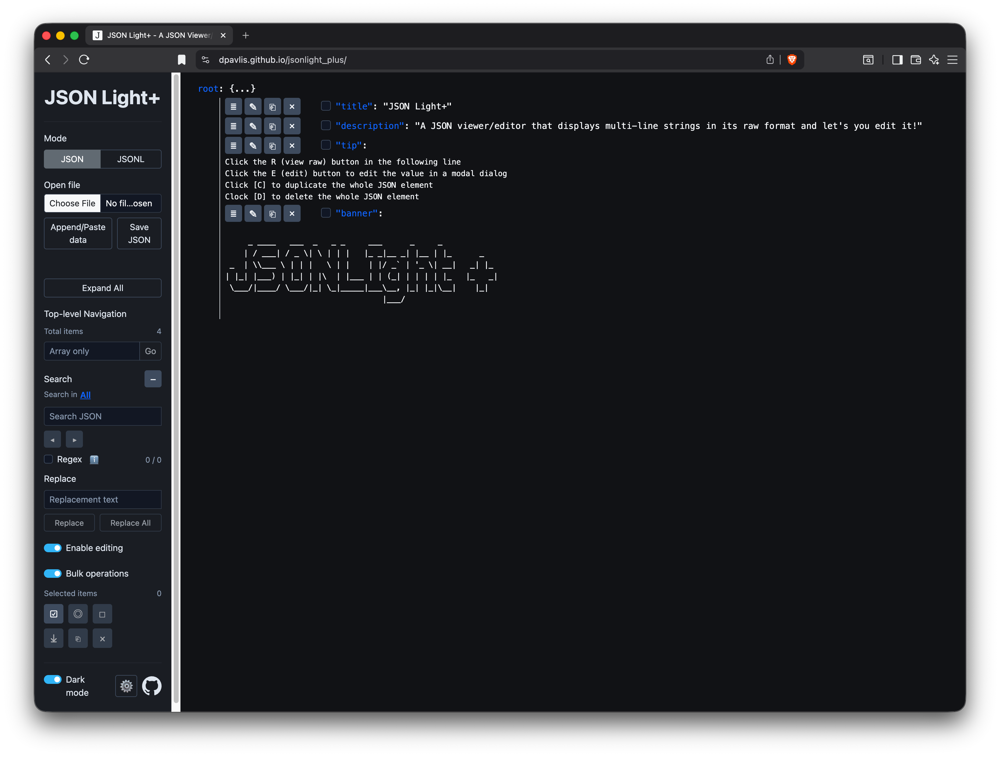

# JSON Light Plus

**[🚀 Live Demo](https://dpavlis.github.io/jsonlight_plus/)**

## About

A JSON/JSONL viewer and editor designed for readability and practical editing workflows.

	

<em>Screenshot of JSON Light Plus in action &mdash; click for the full-size image.</em>

## Getting Started

### Option 1: Use Online (Easiest)
Just visit **[https://dpavlis.github.io/jsonlight_plus/](https://dpavlis.github.io/jsonlight_plus/)** in your browser—no installation needed!

### Option 2: Run Locally
1. Clone this repository (or download just the `docs` subdirectory)
2. Open `docs/index.html` in your browser
3. Start viewing and editing your JSON/JSONL files

Completely standalone—runs entirely in your browser with no dependencies.

## Key Features

### Multi-line String Display (Original)
Unlike most JSON viewers, JSON Light properly renders multi-line string values with actual line breaks instead of `\n` escape sequences. No more cluttered, compact passages—see your text as it's meant to be read.

### Advanced Editing Capabilities (Plus Version)
This Plus version adds powerful editing features specifically designed for working with LLM training data formats like ShareGPT and Alpaca:

- **Plain-text editing**: Edit JSON string properties as plain text—no manual escaping of newlines, quotes, or special characters
- **Duplicate & delete**: Quickly clone or remove array elements, perfect for managing conversational training examples
- **Search & replace**: Find and modify content across your dataset efficiently

## Why This Fork Exists

While preparing LLM training data in ShareGPT (JSONL) and Alpaca (JSON) formats, I struggled to find a free tool that let me edit multi-line code examples and conversation text without wrestling with JSON escaping. This fork bridges that gap by combining the original JSON Light's excellent display with practical editing capabilities.

## Acknowledgments

Grateful thanks to:
- The original JSON Light author for the solid foundation
- GitHub Copilot for accelerating the development of these extensions
